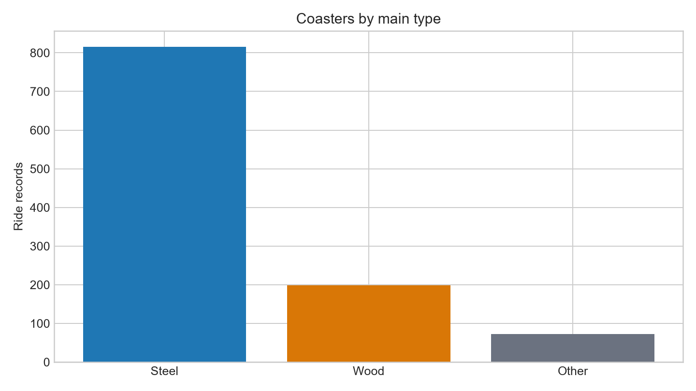
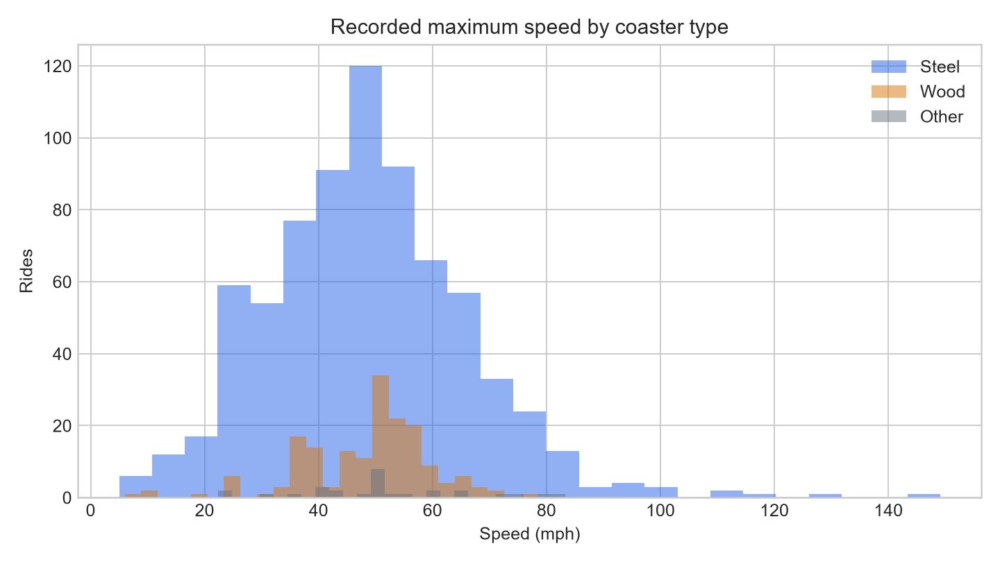
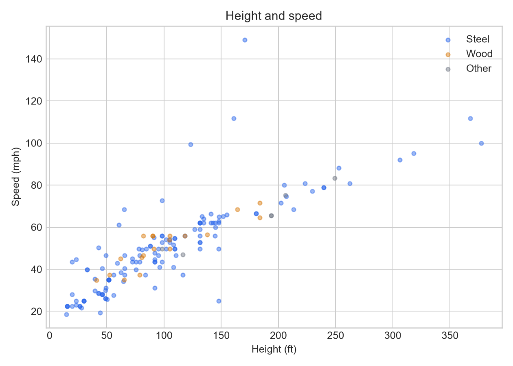
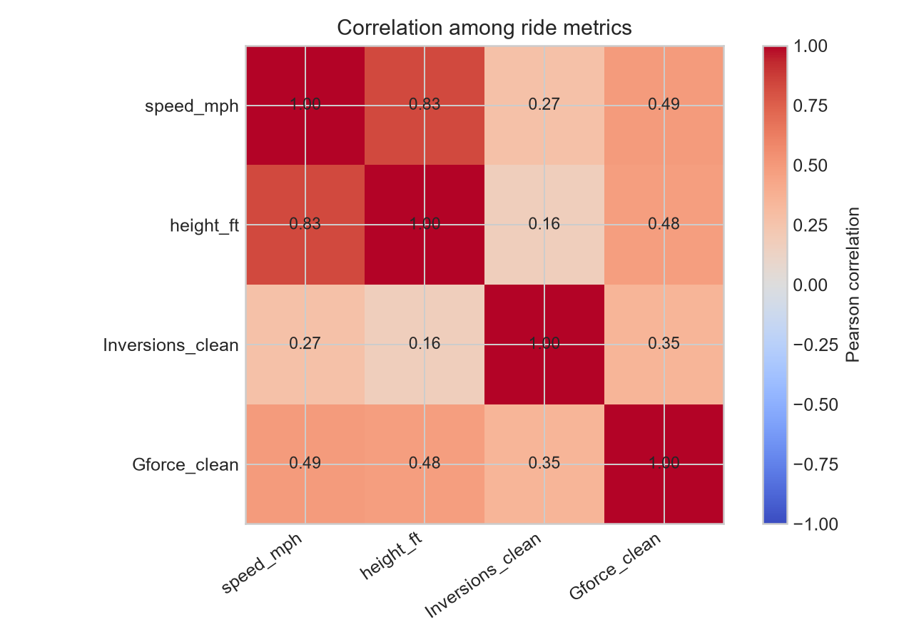

# Roller Coaster Database: Exploratory Data Analysis

**Project focus:** How do recorded ride height, speed, and type relate across the coaster records?

## Executive summary

This analysis follows the video’s EDA sequence: understand the data, check and prepare fields, examine individual features, compare relationships, and answer a focused question. The source contains 1,087 coaster records and 56 columns. Steel rides make up 75% of records. Among available measurements, height and speed have a strong positive association (Pearson *r* = 0.83, *n* = 156 paired rides). The median recorded speed is nearly identical across Steel, Wood, and Other classifications (about 50 mph), while available height records suggest Other rides are taller on average; that comparison is based on only six Other rides with height data.

These are descriptive patterns in a scraped, incomplete snapshot. They do not establish that height causes speed, or represent a complete census of current coasters.

## Dataset and preparation

- **Source:** Rob Mulla’s [Roller Coaster Database dataset on Kaggle](https://www.kaggle.com/datasets/robikscube/rollercoaster-database), also used in the [referenced tutorial notebook](https://www.kaggle.com/code/robikscube/introduction-to-exploratory-data-analysis). The dataset description says records were scraped from Wikipedia.
- **Snapshot coverage:** Introduced years run from 1884 to 2022.
- **Shape:** 1,087 rows × 56 columns; 0 exact duplicate rows.
- **Analysis fields:** `Type_Main`, `year_introduced`, `speed_mph`, `height_ft`, `Inversions_clean`, and `Gforce_clean`. Numeric fields were coerced to numeric values; the curated unit-normalized columns were used for consistent comparisons.
- **Missingness:** Speed is missing for 150 rows (13.8%); height for 916 (84.3%); G-force for 725 (66.7%). Inversions and introduced year are complete. Missing values were left missing rather than imputed, and each comparison uses only records with the required measurements.

## Statistical summary

| Measure | Available n | Mean | Median | 25th–75th percentile | Range |
|---|---:|---:|---:|---:|---:|
| Speed (mph) | 937 | 48.6 | 49.7 | 37.3–58.0 | 5.0–149.1 |
| Height (ft) | 171 | 102.0 | 91.2 | 51.8–131.2 | 13.1–377.3 |
| Inversions | 1,087 | 1.33 | 0 | 0–2 | 0–14 |
| G-force | 362 | 3.82 | 4.0 | 3.4–4.5 | 0.8–12.0 |

### Record mix and speed by type

| Main type | Records | Share | Speed available | Median speed (mph) | Mean speed (mph) |
|---|---:|---:|---:|---:|---:|
| Steel | 816 | 75.1% | 736 | 49.7 | 48.6 |
| Wood | 198 | 18.2% | 173 | 50.0 | 48.4 |
| Other | 73 | 6.7% | 28 | 50.0 | 51.1 |

Speed distributions substantially overlap, so the dataset gives little indication that the broad type category alone separates typical maximum speed. The small available sample for Other rides limits that comparison.

## Visual findings

Height and speed have the strongest observed numeric relationship (*r* = 0.829, 156 paired rows). Speed also correlates moderately with G-force (*r* = 0.489, *n* = 359 pairs) and inversions (*r* = 0.266, *n* = 937). Height and G-force correlate at *r* = 0.475 (*n* = 71); inversions and G-force at *r* = 0.345 (*n* = 362). These pairwise sample counts differ because measurements are missing. Pearson correlations describe linear association and can be affected by extreme observations; they are not causal effects.

The height-vs-speed plot shows a clear upward pattern, with a few very tall/fast observations extending the range. For height, only 15.7% of rows have values, so the relationship may reflect which records received detailed documentation as well as ride design.

## Focus question: do newer records indicate faster rides?

The median available speed rises from 45 mph in the 1980s to 50 mph in the 1990s and 2000s, 52.8 mph in the 2010s, and 56 mph in the 2020–2022 records. This is consistent with a gradual increase in recorded speeds among these observations. The latest-decade sample contains only 40 rides, the final period spans three years, and records with missing speed are excluded. This is a descriptive time pattern, not a forecast or proof of a design trend.

## Conclusion and next steps

In this snapshot, coaster height is the clearest correlate of speed. Type labels show little difference in median speed, and newer introduced-year records have higher median recorded speed than older decades. Sparse height and G-force data, uneven documentation, outliers, and the 2022 coverage limit what can be generalized.

For a stronger follow-up, refresh the source data, validate extreme values against source pages, compare height-speed relationships within Steel and Wood records, and report robust measures such as Spearman correlation alongside Pearson. If the goal is prediction or causal explanation, define the target and confounders first; this EDA alone does not support causal claims.

## Reproducibility

The companion notebook contains the pandas workflow and chart code. The CSV used is included as `coaster_db.csv`. Charts are saved as PNG files in this output folder. The analysis was run on 2026-09-25.
