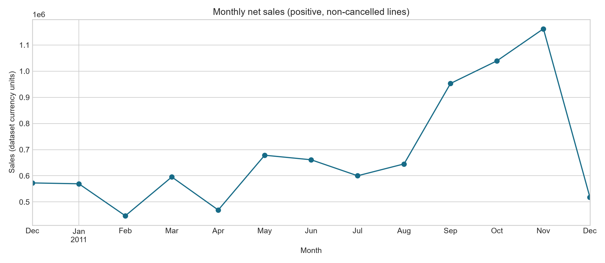
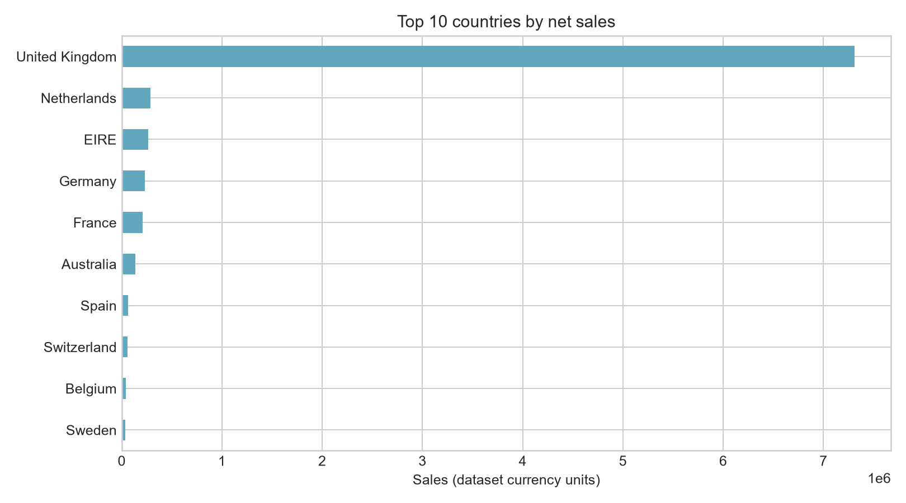
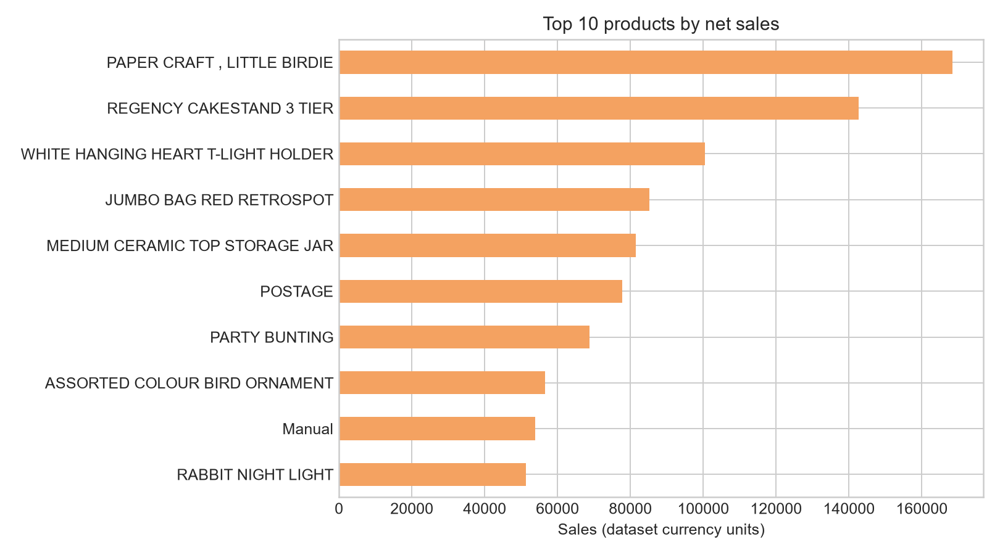
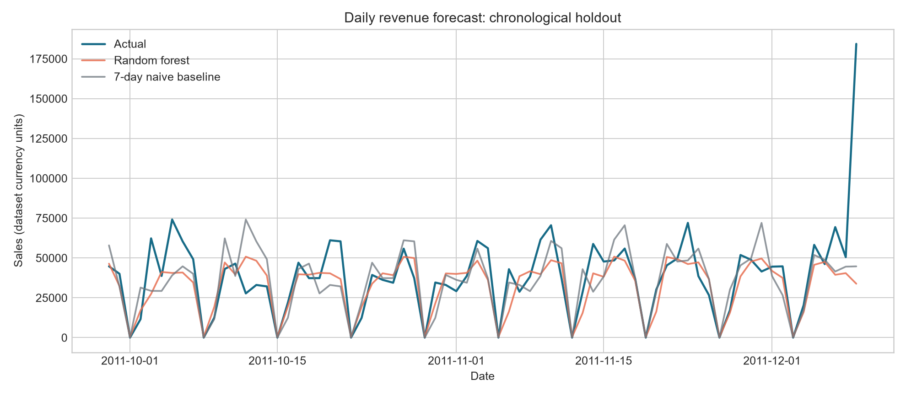

# Retail Sales and Customer Analysis

An end-to-end applied data project using the **UCI Online Retail** transactional dataset. The analysis follows a practical workflow: define business questions, inspect and clean invoice lines, derive sales and customer metrics, visualize patterns, then evaluate a simple time-aware revenue model.

## Business questions

1. How did sales change over the observed period, and when was the peak month?
2. Which countries and products contributed the most net sales?
3. How many identifiable customers returned, and how are customers distributed across simple value/frequency segments?
4. Can recent daily sales history improve on a simple weekly-naive forecast on a chronological holdout?

## Dataset and attribution

The workbook contains 541,909 invoice lines for a UK-based online gift retailer, covering 1 December 2010 through 9 December 2011. The source describes 6 dataset features (the downloadable workbook also includes derived/identifier fields) and notes the retailer serves many wholesalers.

Source: Daqing Chen (2015), [Online Retail, UCI Machine Learning Repository](https://doi.org/10.24432/C5BW33), licensed CC BY 4.0. Dataset page: https://archive.ics.uci.edu/dataset/352/online+retail

## Run it

Open `Retail_Sales_Analysis.ipynb` in Jupyter and run the final cell. Or run `python analysis.py` from this folder. The script reads `Online_Retail.xlsx`, writes `results.json`, and recreates all charts in `figures/`.

Dependencies: Python 3.10+, pandas, numpy, openpyxl, matplotlib, scikit-learn.

## Method and caveats

- Invoice numbers beginning with `C` are cancellations. For the core sales analysis, cancellation lines, nonpositive quantity/price lines, and lines without a customer ID are excluded. Cancellation/returns are therefore not netted against sales. The downloadable raw workbook remains untouched.
- Line sales are `Quantity × UnitPrice`. The dataset does not include an explicit currency field; amounts are reported in dataset price units.
- Customer segments are transparent descriptive rules: **Champions** have at least 3 orders and spend at or above the 75th percentile; **One-time** customers have one order; all others are **Regular**. They are not predictive labels.
- The final 20% of daily observations are held out in date order. A random forest uses only prior-day / prior-week / prior-fortnight revenue, trailing 7-day mean, weekday, and month. It is compared with a 7-day seasonal naive forecast. The period is short and includes sparse/zero-sales dates, so forecast scores should not be generalized to other years.
- This single retailer and historical period do not establish causal effects or current market behavior.

## Main findings

- Cleaned identified-customer transactions produced 8.91 million dataset price units across 18,532 invoices and 4,338 customers.
- The United Kingdom generated 82.0% of included sales. November 2011 was the highest-sales month (1.16 million price units).
- 65.6% of identified customers made at least two purchases. The Champions rule selected 1,013 customers.
- On the chronological 72-day holdout, the random forest MAE was 11,146 versus 13,155 for the weekly-naive baseline (15.3% lower). This is a limited backtest, not evidence of dependable future forecasts.

## Visual findings

